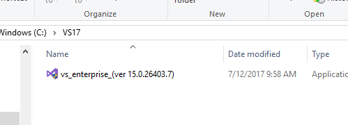
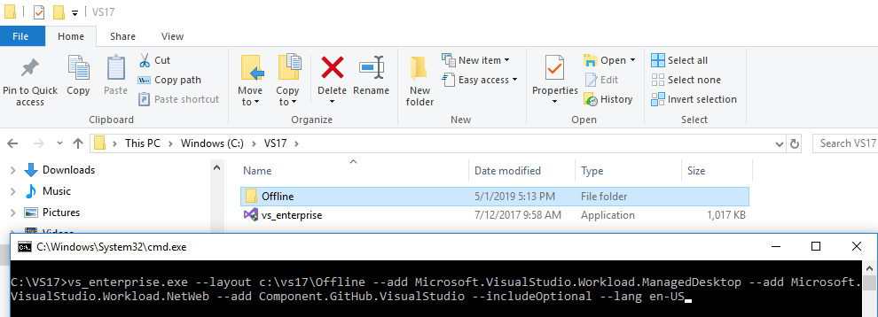
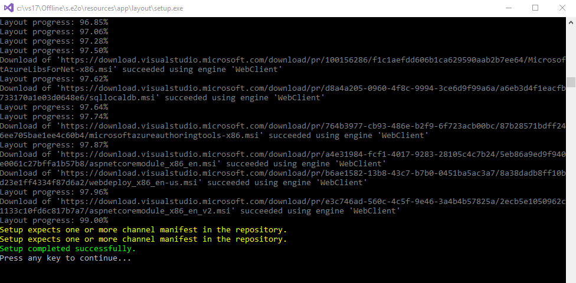
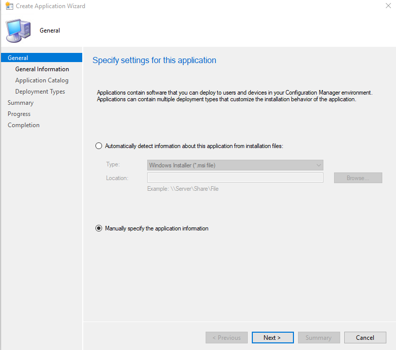
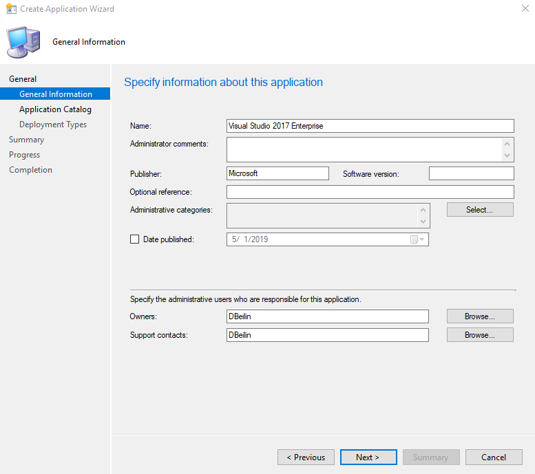
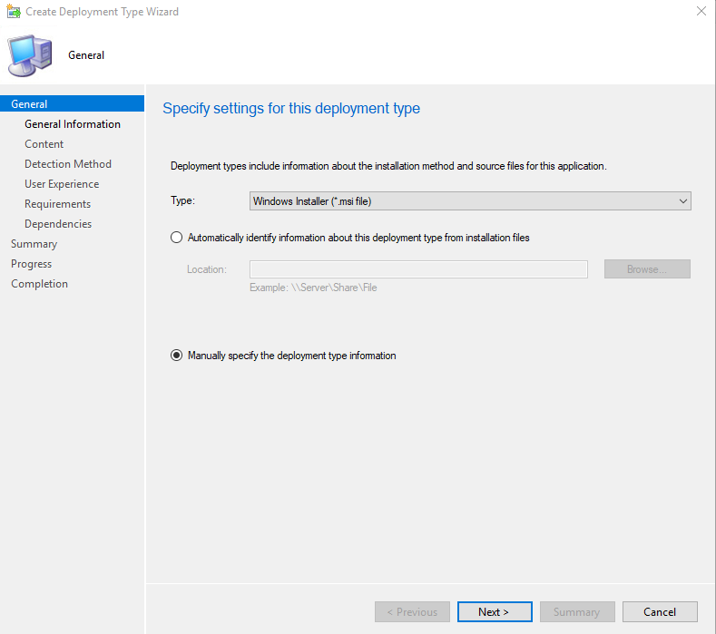
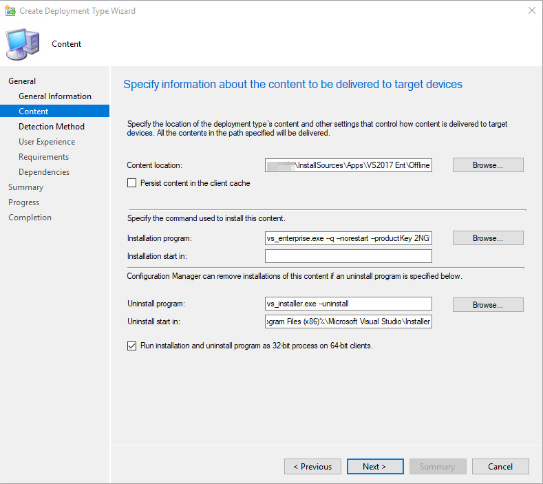
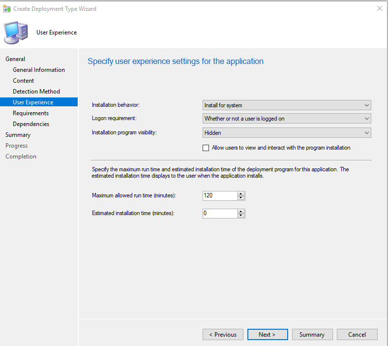

In this tutorial, we’ll go through deploying VS17 in SCCM.

Download the installer and save it under a folder of your choice. For this tutorial I’ll use `C:\VS17`:


Open CMD and use -layout command of your choice.
My command:
```
vs_enterprise.exe --layout c:\vslayout --add
Microsoft.VisualStudio.Workload.ManagedDesktop --add
Microsoft.VisualStudio.Workload.NetWeb --add
Component.GitHub.VisualStudio --includeOptional --lang en-US
```

:::info
  - Add components as you please, the list can be found [here](https://docs.microsoft.com/en-us/visualstudio/install/create-an-offline-installation-of-visual-studio?view=vs-2017).
  - the full featured installation requires about 40GB of free space.
:::



It will now download all the necessary files to the folder.




Copy all the files to your SCCM server and let’s create a new App to deploy.








Point to the offline files we downloaded earlier as the “content location”.

For the installation command we’ll use the same command we used for the `–layout` command earlier when we downloaded the files offline. Just add your desired switches to the installation.

:::note
  - Add `–productKey` to use your license
  - More information on [switches](https://docs.microsoft.com/en-us/visualstudio/install/use-command-line-parameters-to-install-visual-studio?view=vs-2019).
:::
```
Installation Program: vs_enterprise.exe --add
Microsoft.VisualStudio.Workload.ManagedDesktop --add
Microsoft.VisualStudio.Workload.NetWeb --add
Component.GitHub.VisualStudio --includeOptional --quiet --wait --norestart --productKey XXXXXXXXXXXXXXXXXXXX
```

---

:::tip
    Uninstall: `vs_enterprise.exe --uninstall`
:::



I personally only use file detection as the discovery method.
Use the path to the default installation folder and search for `devenv.exe`

Path: `%ProgramFiles(x86)%\Microsoft Visual Studio\2017\Enterprise\Common7\IDE`




That’s it. Deploy and test to see if it works.

:::tip
  - Don’t forget to to distribute to your DP.
  - You can improve this deployment by adding another detection method for the VS version you’re installing.
  - You can also add dependencies for this to be installed if you’re deploying outside of your task sequence.
:::

Good luck 🙂
